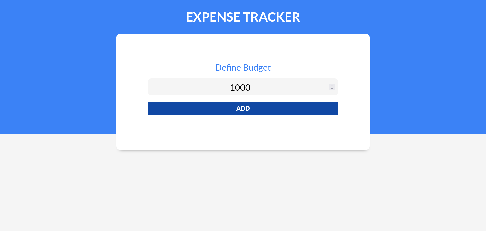
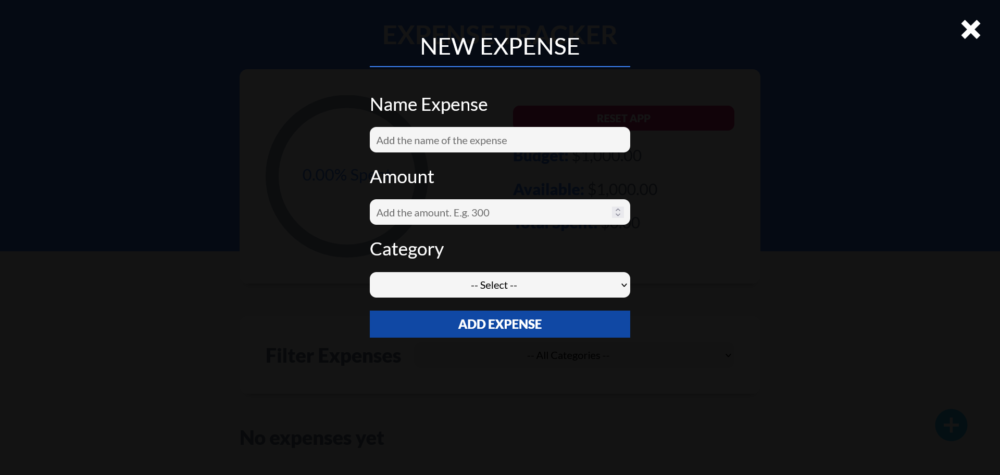
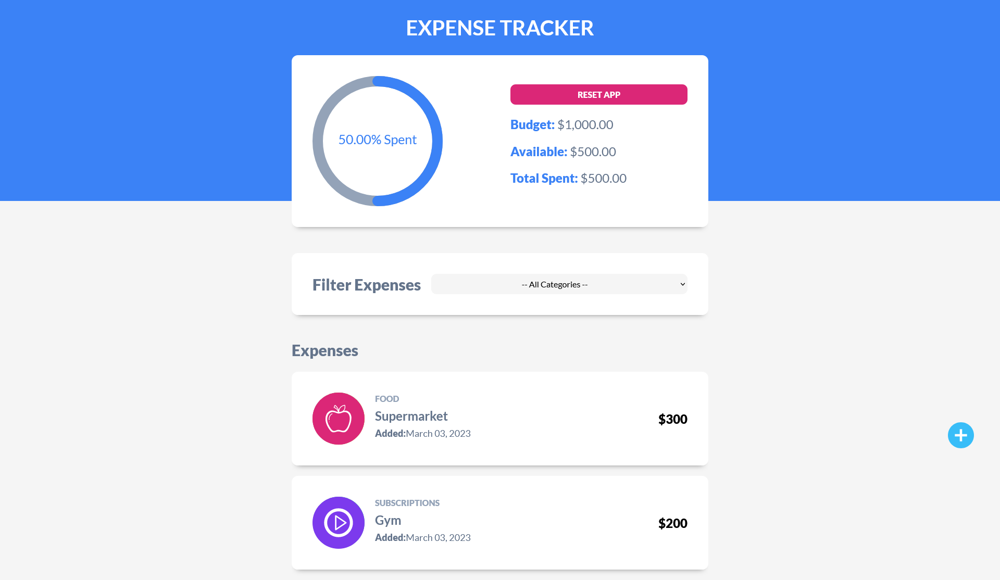

# Expense Tracker Application.

Application that helps users track their spending by allowing them to create a budget and input,categorize, edit and delete their expenses.

## Table of contents

  - [Overview](#overview)
  - [The project - Features](#the-project)
  - [Screenshot](#screenshot)
  - [Links](#links)
  - [My process](#my-process)
  - [Built with](#built-with)
  - [What I learned](#what-i-learned)
  - [If I had more time I would change this](#if-i-had-more-time-i-would-change-this)
  - [Continued development](#continued-development)
  - [Author](#author)

## Overview

### The project

Users should be able to:

- Define a budget.
- Add, edit and delete their expenses.
- Experience Form Validation (basic and data form validation) for both the budget and expenses input.
- Filter through their expenses according to categories.
- See a circular progress bar of their spent money.
- Have their budget and expenses saved on Local Storage for later review.
- Reset the app, thus deleting the budget and expenses.
- Check their total and available budget and the amount spent.
- View the optimal layout depending on their device's screen size.
- See hover states for interactive elements.

### Screenshot

### Links

- Live Site URL: [Expense Tracker App Live](https://expenses-tracker-jee.netlify.app/)

## My process

### Built with

- [React](https://reactjs.org/) - JS library
- [Vite](https://vitejs.dev/) - React environment
- [React Circular Progressbar](https://www.npmjs.com/package/react-circular-progressbar) - For circular progress bar component
- [React Swipeable List](https://www.npmjs.com/package/react-swipeable-list) - For rendering the lists of expenses with swipeable features
- [CSS3](https://www.w3.org/Style/CSS/) - For style
- [Semantic HTML5 markup](https://www.w3.org/html/) - For the web structure
- Flexbox
- Mobile-first workflow

### What I learned

- 

### If I had more time I would change this

- As I said in previous READMEs: Testing, testing and more testing.
- Other than that, I am more than happy with the website and it does its job very well.

### Continued development

After this website I am going to start building my Portfolio and leave theory a little bit to the side. After my Portfolio is finished I am planning to study Testing and TypeScript.

## Author

- Twitter - [@CokoEche](https://twitter.com/CokoEche)
- LinkedIn - [@jorgeecheverria-dev] (https://www.linkedin.com/in/jorgeecheverria-dev/)
